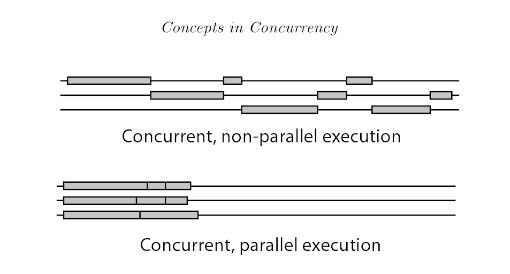
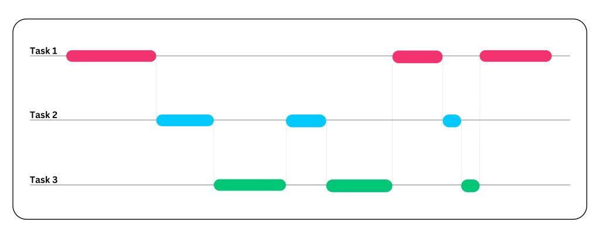
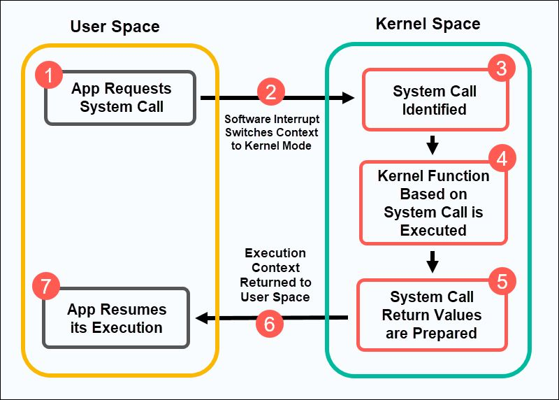
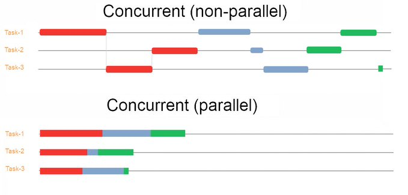
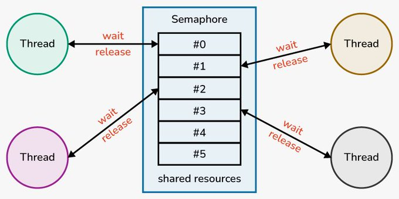
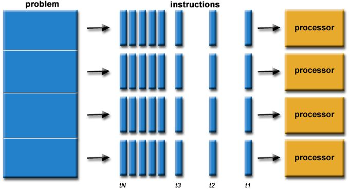

# Todo sistema paralelo é concorrente - mas nem todo programa concorrente é paralelo.

## Concurrency

#### CPU
The CPU runs one thread at a time in 1 core (if you have 18 core, you can run 18 threads).

A single-core CPU achieves concurrency by rapidly switching between multiple threads.

What happens in a Single-Core CPU:
- Concurrency still happens, but only one thread runs at any given time.

- The OS switches between threads so quickly that it seems like they are running simultaneously.

- This is called time slicing (or time-sharing) and is managed by the CPU scheduler.

**Multiple threads can be scheduled dynamically, like above:**

**How a CPU with one core run a game, with audio, controllers, video, etc.**
    The tips is, the CPU separates the time, for example with 1 second, the CPU separe in 1000 windows of 1 millisecond and each task (audio, controller, etc) receive this 1 millisecond, and the buffer for video for example do this to generate the video.

Concorrencia é a propriedade de um programa de ser dividido em partes sem ordem definida de execução. Isto é, você tem partes do programa onde, na hora de desenvolver, você não especifica a ordem delas

- Concorrência é sobre NÂO SAVER A ORDEM DAS COISAS.

Por que não saber a ordem das coisas é útil ?

As vezes o seu programa tem que esperar algo fora dele acontecer.

Se o seu programa tem ordem de execução definida, seu processo teria que ficar parado ate isso se resolver. Já se tem partes que não contam com ordenação, uma parte que não depende da atual pode executar.

`O JS por ser single core, é uma boa ferramenta para entender algumas coisas`

Quando temos um `await` por exemplo, ele da a vez dele para outro código possa executar. O resto do código pós-await so entra no fim da stack quando o resultado da operação async estiver pronto.

`Por isso que comumente se diz que programação funcional é melhor para sistemas concorrentes. Na programação funcional, não contamos com estado mutável ou efeitos colaterais. - Livro para ler sobre - Functional and concurrent programming`

__________________________________________________________________________________________________________________________________________________________

TODO: read more about.
TODO: read about time slice
TODO: Read about callbacks -> promisses -> monads -> algebraic effects

In a system with a single processor, it is not possible to have processes or threads truly executing at the same time. In this case, the CPU is shared among running processes or threads using a process scheduling algorithm that divides the CPU's time and yields the illusion of parallel execution.

## Parallelism

Paralelismo é um *tipo* de concorrência onde as coisas não apenas executam sem ordem definida, mas realmente executam ao mesmo tempo.

É possivel usar construtos que fazem sincronização explícita entre as unidades de paralelismo, como mutexes e semáforos. Essencialmente esses construtos garantem a propriedade "precisa ter ordenação nos acessos"

Mas, como nada é de graça, quanto mais sincronização você adiciona ao seu programa, mais da vantagem do paralelismo - de seu código executar mais rápido por mais partes serem simultâneas - você perde.

TODO: ver sobre abordagens de controle de execução paralela
