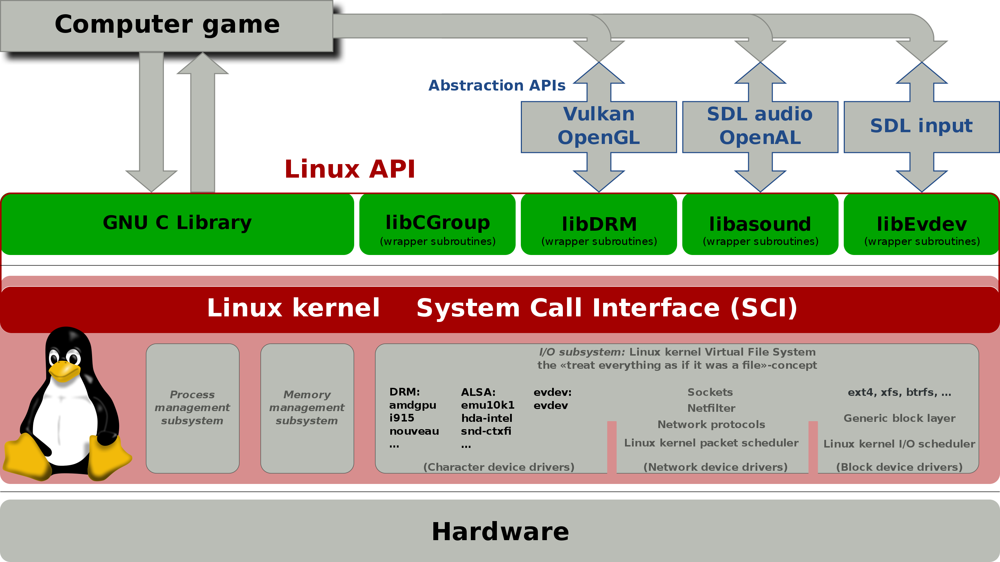

`SO` vem de "operating system".

Antes dos SOs existirem, um "computador" era operado por humanos.

Como computadores eram caros e de difícil acesso, se formava uma fila de programas a serem executados.

E assim surgiu os sistemas operacionais, que ao inves de operadores humanos cuidarem de uma fila de programas, o próprio computador faria isso. Automatizam a lógica de administrar uma fila de programas a serem executados. (e reduzir erros humanos por complexidade).

E o `SO` nada mais é do que um programa na memória, que não se apagava.

`Dar uma pesquisada sobre sistemas "multitarefa" `

o `SO` basicamente gere os recursos do computador, garante o controle sobre quais recursos um programa pode acessar, e possibilitar que programas executem simultaneamente sem competir por recursos.

Se um programa quer usar recursos da máquina, ele *solicita* isso ao sistema operacional. O `SO` oferece as APIs que os programas precisam usar para fazer vários tipos de tarefas.

