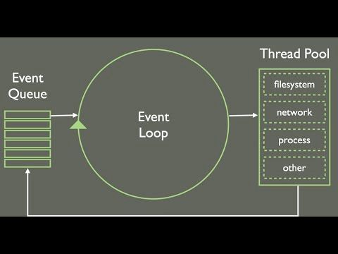
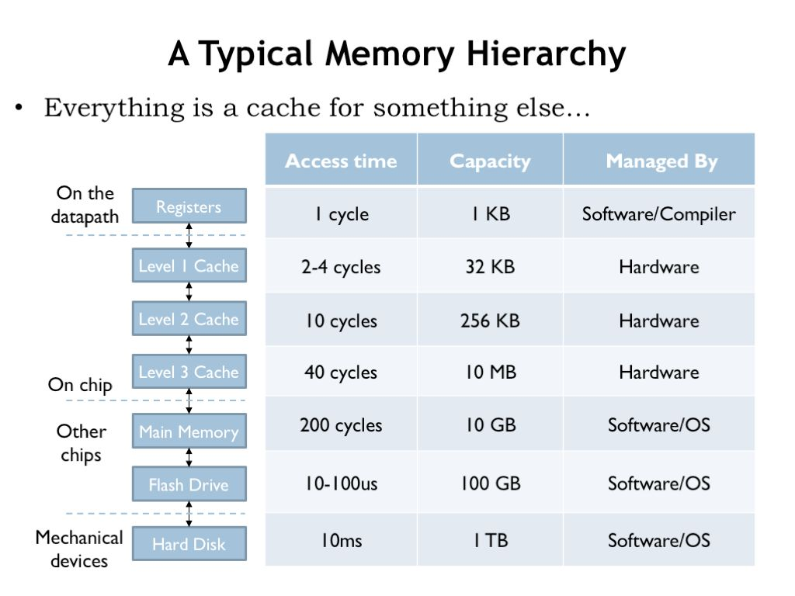
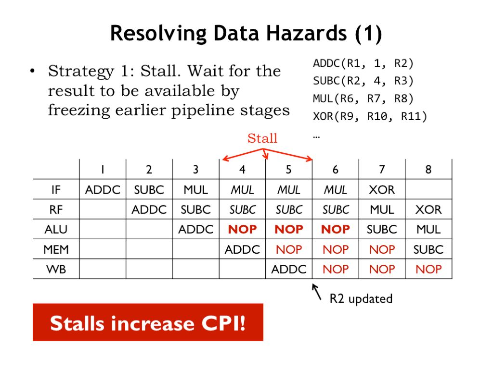
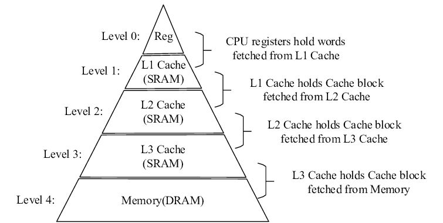

[What Every Programmer Should Know About Memory](https://people.freebsd.org/~lstewart/articles/cpumemory.pdf)

Otimizações, 90% das vezes, so resolve se introduz alguma "melhoria assintóticas".

Melhoria assintótica = Trocar um algoritmo que faz mais operações para um determinado tamanho de entrada para um algoritmo que faz menos operações, o famoso "Big O Notation"

**Regra 0 da otimização: NÃO OTIMIZE MAIS DO QUE O NECESSÁRIO.**

Códigos otimizados são piores de let, e legibilidade na maioria das vezes é mais importante que extrair cada gota de performance possivel.

**E se precisar extrair cada gota ?**

Se for uma programa web, APIs, etc. Maior parte do tempo dele é gasto com I/O. Então precisamos ter certeza que, enquanto uma chamada está esperando, tem outras coisas executando.

Sempre bom verificar e ter certeza que não está deixando o sistema "travado" esperando coisas acontecerem para continuar.

1. Validar se está utilizando os melhores algoritmos, e depois válidar se o programa está passando muito tempo esperando por entrada/saída. Caso não resolva, nos resta olhar CPU.

> Um problema que temos nos computadores atualmente, é que o hardware das CPUs evoluiram muito mais rápidos que o hardware de armazenamento de dados - memórias e especialmente HDDs/SSDs.
>
> `

Se seu programa não usa rede, provavelmente ele perde mais tempo esperando acessos de memória.

Assim como o software aloca código para rodar enquanto outras partes do código aguardam chamadas de sistema não-bloqueantes, a própria CPU *reordena instruções* pra que código que não depende de algum carregamento de memória execute enquanto a CPU está esperando esse carregamento ser concluído.

Mas se a CPU não tiver instruções suficientes para alocar, ou se tiver alguma instrução condicional no meio do caminho, a CPU pode precisar parar e esperar. É o chamado "pipeline stall" - e como a memória é muito mais lenta que a CPU, muita performance pode se perder aí.

Se seu programa perde muita performance com "pipeline stall", a solução é ler o assembly gerado, e identificar pontos onde o carregamento de dados está sendo ineficiente.

Mais importante que os "stalls", é o uso dos caches. Pela memória ser lenta, a CPU tem vários blocos de memória "dentro" da CPU, muito mais rápidos que a memória principal.

Então para otimizar CPU, tem que ser garatir o quanto possivel que todos os acessos possiveis aconteçam no cache não na memória. Esse é um dos maiores fatores de CPU-bound.

`

# Resumindo, fatores a serem considerados para otimizar programas de maneira EFICIENTE, seria:

0. Medir antes de otimizar e saber bem quais partes determinam a performance da aplicação.

1. Os algoritmos com complexidade assintótica ideal nas partes principais do programa ? Uma função usada frequentemente usa um algoritmo que faz muitas operações desnecessárias ?

2. Os passos anteriores estão ok ? Verificar se o computador está esperando desnecessariamente por operações externas - leitura de arquivo, rede, etc.

3. Os passos anteriores estão ok ? Verificar usos de caches, e se possui paradas de execução para esperar carregamentos de memória.

## Ferramentas que podem ajudar.

**[NodeJS](https://nodejs.org/en/learn/getting-started/profiling)** - tem ferramentas de perfilamento de execução muito boas.

**[Flamegraph](https://github.com/brendangregg/FlameGraph)** - muito usado para determinar quanto tempo o sistema passa em cada função.

**[Strace](strace.io)** - Avaliar esperas por operações externas (maioria dos sitemas baseados em Unix possuem).

**[Valgrind](valgrind.org)** - Avaliar e melhorar utilização de cache e utilização de memória no geral.
