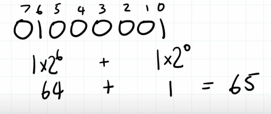

# Hexadecimal notation.

0: 0000 = 0

1: 0001

2: 0010

3: 0011

4: 0100

5: 0101

6: 0110

7: 0111

8: 1000

9: 1001

A: 1010 = 10

B: 1011 =

C: 1100 =

D: 1101 =

E: 1110 =

F: 1111 = 15

65 = 01000001

`01000001` This is a 8 bit number or 1 byte (0x41)

You can read/understanding like this

`0110000110011110` This is a 16bit number or 2 byte (0x619E)

In the 16 bits, we broken this in 4 parts of 4 bits each, and after transform to a hexadecimal notation, the number `0110000110011110` for example:

| 0110  | 0001  | 1001  | 1110  |
| ----- | ----- | ----- | ----- |
|   6   |   1   |   9   |  14   |
|   6   |   1   |   9   |  E    |

Decimal     = 65

Binary      = 0b01000001

Hexadecimal = 0x41 | $41 | #41 | x41

# Some examples printing and showing the bits of a file.

Exemplo de um HELLO WORLD em um txt simples

Quando utilizamos `xxd -b` ele nos retorna o `HELLO WORLD` escrito em 8 bits (maiusculo e minusculo importa).

Quando utilizazmos o `xxd` ele nos retorna o `HELLO WORLD` em tabela HEXADECIMAL, exemplo:

OBS: cada 2 letras são 2 bytes

4845 4c4c 4f20 574f 524c 440a

48 = H
45 = E

4c = L
4c = L

4f = O
20 = space

57 = W

Para entender mais procure por tabela HEXADECIMAL
