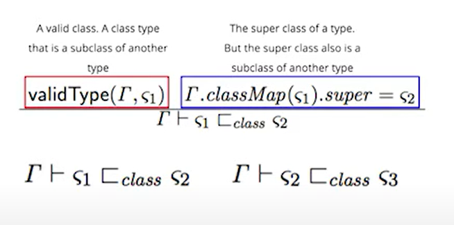

It's this youtube [video](https://www.youtube.com/watch?v=AJ-yQEfvdVc&t=726s&ab_channel=Jfokus)

Programmin languages use a type system to look at a program and determine if a represetation error will happen or not.

What are the possible stategies that a type system can use to handle representation errors ?

> Representation errors: All languages have *Data* and *Operations*. If you use a incompatible pieces of data for an operation, you will have a ***Representation Error***.

# Strategies.

(This order means nothing)

1. **Strong**
    - Genereate a compile error
    - Perform a type check before run the code.
    - Well defined error set (example: exceptions)

2. **Weak**
    - Unpredictable runtime errors.
    - Try implicit conversion
3. **Static**
    - A compiler tags pieces of code and tries to infer the behavior will be valid or not (before the program runs)
4. **Dynamic**
    - A compiler/interpreter to generates code to keep track of the data.

Assembly is a language where not use nothing.

Languages can have more than one.

Examples:

- C# is static and strong.
- Python is dynamic.
- JS weak.

Type theory is also about proofing statements in a precise way.

In order to do a deep analysi of a language:

1. Collect all the keywords and analyse the grammar for each of these works individually.

2. Make it look like mathematics - Replace text with variables. (mathematics people like to use greek letters)

    - Example: `throw Exception` in C#, turn it into `C Exception`

3. After this mapping. Group these results in sets and remove duplicates. These sets will reveal the types.
    - A very difficult task in science is grouping topics appropriately.

4. Use symbolic logic to simplify your system. (In logic if you come with an expression you can simplify you have to keep opening it until have true or false).
    - Symbolic logic is a simple way to understanding what is going on in a logic system. And to need to add more complexity or environments around your logic veriables, we need to work with `Predicate Logic`

    - Examples in JAVA.

    
    
    
    

5. Use predicate logic to analyse your system. Start with true statements ('well-formed')

    - 

6. Lambda Calculus. understanding lambda calculus will help you come out with these relation.

    - Lambda Calculus help us to build these statements, highly connected to predicate logic.

    - With Lambda Calculus we can define a **Type** itself.
        - "A type is a collection of objects habing similar structure."

    - In lambda calculus, $λx.x + 1$ is $(A -> A)$

    Some references:

    - Lambda Calculus is about formal function theory. We can apply them to functional programming. We can apply them to functional programming. We can also apply the ideas to general functions in programming.
        - http://www.cs.le.ac.uk/people/amurawski/mgs2011-tlc.pdf

7. Write some statements that you can prove:

    - "In java, every class type that you can define will be a subclass of a class."

    - How build mathematics based on somethint that we all familiar.

**Skatch a mathematical expression**:

    class => ζ
    environment => Γ
    class relation (subclass or class itself) => `⊂ class` or `⊆ class`

Let's build a sentence:

In an environment Γ, we can prove (⊢) that a class of a certain type (ζ1) is a subclass (⊆ class) of another type or the other type itself (ζ2)

$Γ ⊢ ζ1 ⊆ class ζ2$

8. Reading this complex image

    

We can evaluate to this:

- In a environment we have a certain type that is the class itself or a subclass of another type

## Why all of this is important ?

It's a important to have a mecanism to check the specs are true.

We can start identify things are not true in the specs before starting write the code

> Some notes.
>
> I don't think it's really thing we will use in usually days, problably more for who wrote languages/compilers/interpreters maybe, not sure.

- Reduce runtime errors by checking the types.

- Interest to use to compare different languages as well.

- A solid point to chose a language.
> have ?

In this example, this Java code compile, but have a runtime exception:

# Final notes

- Most type theory studies are applied to functional languages.

